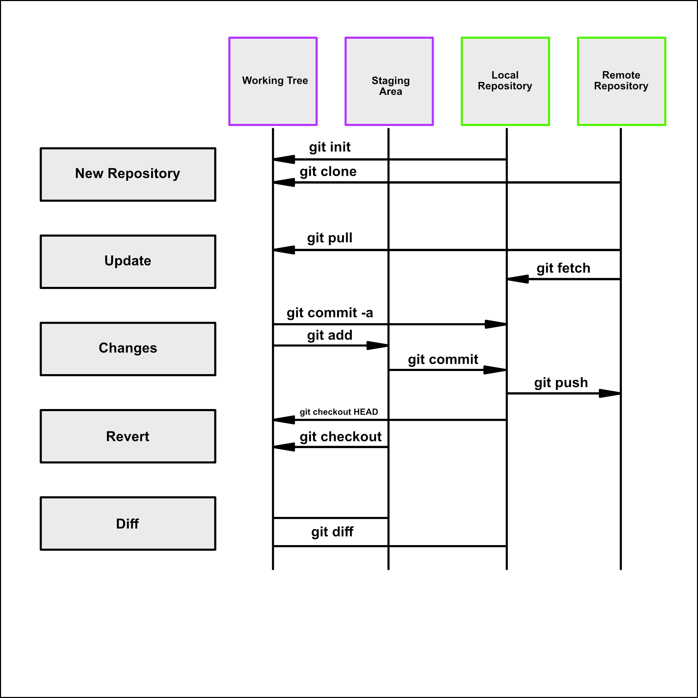

---

# Table of Content
* [Getting started](#getting-started)
* [Setup](#setup)
* [Configuration files](#configuration-files)
* [Create](#create)
* [Local Changes](#local-changes)
* [Commit History](#commit-history)
* [Branches](#branches)
* [Tags](#tags)
* [Update & Publish](#update--publish)
* [Merge & Rebase](#merge--rebase)
* [Undo](#undo)
* [.gitignore Rules](#gitignore-rules)

---
## Architecture


---
## Getting started

[GIT Documentation](https://git-scm.com/docs)

**Basic GIT Syntax:**
```
git [command] [--flags] [arguments]
```

**Getting help:**

```
git help [command]
```
*Example:*
```
git help push
```
---

## Setup

**Show current config:**
```
git config --list
```
```
git config [--local|--global|--system] --list
```

**Set username**
```
git config --global user.name "[firstname lastname]"
```
**Set email address**
```
git config --global user.emal "[your email]"
```

**Set automatic command line coloring for GIT for easy reviewing**
```
git config --global color.ui auto
```
**Set global editor for commit**
```
git config --global core.editor vi
```
---

## Configuration Files
**Repository specific configuration file (--local)**
```
<repo>/.git/config
```

**User-specific configuration file (--global)**
```
~/.gitconfig
```

**System-wide configuration fiel (--system)**
```
/etc/gitconfig
```
---

## Create
**Clone an existing repository**
```
git clone ssh://user@domain.com/repo.git
git clone http://domain.com/user/repo.git
```

**Create a new local repository in the current directory**
```
git init
```

**Create a new local repository in a specific directory**
```
git init <directory>
```
---

## Local Changes
**Show changes in working directory**

Untracked files (RED) - tracked files (GREEN)
```
git status
```

**Changes to tracked files**
```
git diff
```

**Changes for a specific file**
```
git diff <file>
```

**Add all changes to the next commit**
```
git add .
```

**Add only the mentioned files to the next commit**
```
git add <file1> <file2> <...>
```

**Commit all local changes in tracked files**
```
git commit -a
```

**Commit previously staged changes**
```
git commit
```

**Commit with message**
```
git commit -m "<your message>"
```

**Commit skipping the staging area and adding message**
```
git commit -am "<your message>"
```
**Change last commit**
```
git commit -a --amend
```

**Move uncommitted changes from current branch to some other branch**
```
git stash
git checkout brach2
git stash pop
```

**Restore stashed changes back to current brach**
```
git stash apply
```

**Restore particular stash back to current branch**

{stash number} can be obtained from ```git stash list```
```
git stash apply stash@{<stash number>}
```

**Remove the last set of stashed changes**
```
git stash drop
```
---

## Commit History

**Show all commits starting with the newest**
```
git log
```

**Condensed version of git log**
```
git log --online
```

**Show only the x-newest commits**
```
git log --online -<no_of_commits>
```

**Show changes over time for a specific file**
```
git log -p <file>
```

**Show who modified a specific file**
```
git blame <file>
```

**Show reference log**
```
git reflog show
```

**Delete reference log**
```
git reflog delete
```
---

## Branches

**List all local branches**
```
git branch
```

**List all remote branches**
```
git branch -r
```

**List local/remote branches**
```
git branch -a
```

**Create a new branch (no checkout)**
```
git branch <branchname>
```

**Create and switch new branch**
```
git checkout -b <branchname>
```

**Switch HEAD branch**
```
git checkout <branchname>
```

**Checkout single file from different branch**
```
git checkout <branchname> -- <filename>
```

**Switch th previous branch, without saying the name explicitly**
```
git checkout -
```

**Create new branch from existing branch and switch to new branch**
```
git checkout -b <new_branch> <existing_branch>
```

**Checkout and create new branch from existing commit**
```
git checkout <commit_hash> -b <branchname>
```

**Rename current branch to new branch name**
```
git branch -m <new_branch_name>
```

**Delete a local branch (only if merged)**
```
git branch -d <branchname>
```

**Force delete a local branch**
```
git branch -D <branchname>
```
---

## Tags

**Create tag on HEAD reference**
```
git tag <tagname>
```

**Create tag on HEAD reference and open editor to include a message**
```
git tag -a <tagname>
```

**Create tag on HEAD reference and include a message**
```
git tag -a <tagname> -m "<your message>"
```

**Create a lightweight tag**
```
git tag <tagname>-lw
```

**List all tags**
```
git tag
```

**List all tags with messages**
```
git tag -n
```

**Tag old commit**
```
git tag -a <tagname> <commit_hash>
```

**Force to switch commit tag**
```
git tag -a -f <tagname> <commit_hash>
```

**Delete a tag**
```
git tag -d <tagname>
```
---

## Update & Publish

**Show configured remotes**
```
git remote -v
```

**Show information about a remote**
```
git remote show <remote>
```

**Add new remote repository, named < remote >**
```
git remote add <remote> <url>
```

**Rename a remote repository**
```
git remote rename <old_name> <new_name>
```

**Remove a remote (only from your local repository)**
```
git remote rm <remote>
```

**Download remote, but don´t integrate into HEAD**
```
git fetch <remote>
```

**Download remote and merge/integrate into HEAD**
```
git remote pull <remote> <url>
```

**Get all changes from HEAD to local repository**
```
git pull origin master
```

**Get all changes from HEAD to local repository without a merge**
```
git pull --rebase <remote> <branch>
```

**Publish local changes to remote**
```
git push <remote> <branch>
```

**Delete a branch on the remote**
```
git push <remote> --delete <branch>
```

**Publish a single tag**
```
git push <remote> <tagname>
```

**Publish all tags**
```
git push <remote> --tags
```
---
## Merge & Rebase

### Fast-Forward-Merge

*Before*
```
              D --- E (feature_branch)
             /
A --- B --- C (master)
```
*After*
```


A --- B --- C --- D --- E (master)
```
**Condition**: Possible if no other commits have been made to the base branch since branching.

The example below is not working because since commit A another commit D with HEAD reference was made.

```
  B --- C (feature_branch)
 /
A --- D (master)
```

**Performing a Fast-Forward-Merge and delete feature_branch afterwards**
```
git checkout master
git merge feature_branch
git branch -d feature_branch
```

**Performing a Fast-Forward-Merge with merge commit**

```
git checkout master
git merge --no-ff feature_branch
git branch -d feature_branch
```
*Before*
```
  B --- C (feature_branch)
 /
A (master)
```

*After*
```
  B --- C 
 /       \
A ------- D (master)
```


### 3-Way-Merge

A 3-Way-Merge is used if the Fast-Forward-Mege is not possible because branches diverged.

*Before*
```
        D --- E (feature_branch)
       /
A --- B --- C (master)
```

*After*
```
        D --- E
       /        \
A --- B --- F --- C (master)
```

### Merge strategy

**Recursive**
```
git merge -s recursive <branch1> <branch2>
```
This operates on two heads. Recursive is the default merge strategy when pulling or merging one branch. Additionally
this can detect and handle merges involving renames, but currently cannot make use of detected copies. This is the 
default merge strategy when pulling or merging one branch.

**Resolve**
```
git merge -s resolve <branch1> <brach2>
```
This can only resolve two heads using a 3-way merge. It tries to carefully cris-cross merge ambiguities and is
considered generally safe and fast.

**Octopus**
```
git merge -s octopus <branch2> <branch2> <branch3> <branchN>
```
The default merge strategy for more than two heads. When more than one branch is passed octopus is automatically engaged.
If a merge has conflicts that need manual resolution octopus will refuse the merge attempt. It is primarily used
for bundling similar feature branch heads together.

**Ours**
```
git merge -s ours <branch2> <branch2> <branchN>
```
The ours strategy operates on multiple N number of branches. The output result is always that of the current branch HEAD.
The "ours" term implies the preference effectively ignoring all changes from all other branches. It is intended to be
used to combine history of similar feature branches.

**Subtree**
```
git merge -s subtree <branch1> <branch2>
```
This is an extension of the recursive strategy. When merging <brach1> and <branch2>, if <branch2> is a child subtree of
<branch1>, <branch2> is first updated to reflect the tree structure of <branch1>. This update is also done to the
common ancestor tree that is shared between <branch1> and <branch2>.

---

**List merged branches**
```
git branch --merged
```

### Rebase
Moves commits to a new parent (base)

*Before*
```
  B --- C
 /
A --- D
```

*After*
```
        B` --- C`
       /
A --- D
```

**Rebase the current HEAD into <feature_branch>**
```
git rebase <feature_branch>
```

**Abort a rebase**
```
git rebase --abort
```

**Continue a rebase after resolving conflicts**
```
git rebase --continue
```

*Using editor to manually solve conflicts and (after resolving) mark file as resolved*
```
git add <resolved_file>
```
```
git rm <resolved_file>
```

**Squashing commits**
```
git rebase -i <commit-just-before-first>
```

*Replace*
```
pick <commit_id>
pick <commit_id2>
pick <commit_id3>
```

*to*

```
pick <commit_id>
squash <commit_id2>
squash <commit_id2>
```
___

## Undo

**Discard all local changes in working directory**
```
git reset --hard HEAD
```

**Get all files out of the staging area (i.e. undo the last ```git add```)**
```
git reset HEAD
```

**Discard local changes in a specific file**
```
git checkout HEAD <file>
```

**Revert a commit (by producing a new commit with contrary changes)**
```
git revert <commit>
```

**Reset HEAD pointer to a previous commit and discard all changes since then**
```
git reset --hard <commit>
```

**Reset HEAD pointer to a remote branch current-state (e.g. upstream/master, origin/my-feature)**
```
git reset --hard <remote/branch> 
```

**Reset HEAT pointer to a previous commit and preserve all changes as unstaged changes**
```
git reset <commit>
```

**Reset HEAD pointer to previous commit and preserve uncommited local changes**
```
git reset --keep <commit>
```

**Remove files that were accidentally commited before they were added to .gitignore**
```
git rm -r --cached .
git add .
git commit -m "remove file>
```
---
## .gitignore rules

<table width="300">
    <tr>
        <th>Pattern</th>
        <th>Explanation/Matches</th>
        <th>Examples</th>
    </tr>
    <tr>
        <td></td>
        <td>Blank lines are ignored</td>
        <td></td>
    </tr>
    <tr>
        <td># text comment</td>
        <td>Lines starting with # are ignored</td>
        <td></td>
    </tr>
    <tr>
        <td>name</td>
        <td>All name files, name folders, and files and folders in any name folder</td>
        <td>/name.log <br> /name/file.txt <br> /lib/name.log </td>
    </tr>
    <tr>
        <td>name/</td>
        <td>Ending with / specifies the pattern is for a folder. Matches all files and folders in any name folder</td>
        <td>/name/file.txt <br> /name/log/name.log <br> <b>no match: </b> <br> /name.log</td>
    </tr>
    <tr>
        <td>name.file</td>
        <td>All files with the name.file</td>
        <td>/name.file <br>/lib/name.file</td>
    </tr>
    <tr>
        <td>/name.file</td>
        <td>Starting with / specifies the pattern matches only files in the root folder</td>
        <td>/name.file <br> <b>no match:</b> <br> /lib/name.file </td>
    </tr>
    <tr>
        <td>lib/name.file</td>
        <td>Patters specifiing files in specific folders are always relative to root (even if you do not start with /)</td>
        <td>/lib/name.file <br> <b>no match:</b> <br> name.file <br> /test/lib/name.file</td>
    </tr>
    <tr>
        <td>**/lib/name.file</td>
        <td>Starting with ** before / specifies that it matches any folder in the repository. Not just on root</td>
        <td>/lib/name.file <br> /test/lib/name.file</td>
    </tr>
    <tr>
        <td>**/name</td>
        <td>All name folders, and files and folders in any name folder</td>
        <td>/name/log.file <br> /lib/name/log.file <br> /name/lib/log.file</td>
    </tr>
    <tr>
        <td>/lib/**/name</td>
        <td>All name folders, and files and folders in any name folder within the lib folder</td>
        <td>/lib/name/log.file <br> /lib/test/name/log.file <br> /lib/test/ver1/name/log.file 
        <br> <b>no match:</b> <br> /name/log.file</td>
    </tr>
    <tr>
        <td>*.file</td>
        <td>All files with the .file extention</td>
        <td>/name.file <br> /lib/name.file</td>
    </tr>
    <tr>
        <td>*name/</td>
        <td>All folders ending with *name</td>
        <td>/lastname/log.file <br> /firstname/log.file</td>
    </tr>
    <tr>
        <td>name?.file</td>
        <td>? matches a <b>single</b> non-specific character</td>
        <td>/names.file <br> /name1.file <br> <b>no match:</b> <br> /names1.file</td>
    </tr>
    <tr>
        <td>name[a-z].file</td>
        <td>[<i>range</i>] matches a <b>single</b> character in the specified range (in this case a character in the 
        range of a-z, and also be numeric</td>
        <td>/names.file <br> /nameb.file <br> <b>no match:</b> <br> /name1.file</td>
    </tr>
    <tr>
        <td>name[abc].file</td>
        <td>[<i>set</i>] matches a <b>single</b> character in the specified set of characters
        (in this case either a, b, or c)</td>
        <td>/namea.file <br> /nameb.file <br> <b>no match:</b> <br> /name1.file</td>
    </tr>
    <tr>
        <td>name<i>[!abc]</i>.file</td>
        <td><i>[!set]</i> matches a <b>single</b> character, <b>except</b> the ones specified in the set
        of characters (in this case a, b, or c)</td>
        <td>/names.file <br> /namex.file <br> <b>no match:</b> <br> /namesb.file</td>
    </tr>
    <tr>
        <td>*.file</td>
        <td>All files with .file extension</td>
        <td>/name.file <br> /lib/name.file</td>
    </tr>
    <tr>
        <td>name/ <br> !name/secret.log</td>
        <td>! specifies a negation or exception. Matches all files and folders in any name folder
        except name/secret.log</td>
        <td>/name/file.txt <br> /name/log/name.log <br> <b>no match:</b> <br> /name/secret.log</td>
    </tr>
    <tr>
        <td>*.file <br> !name.file</td>
        <td>! specifies a negation or exception. All files with .file extension, except name.file</td>
        <td>/log.file <br> /lastname.file <br> <b>no match:</b> <br> /name.file</td>
    </tr>
    <tr>
        <td>*.file <br> !name/*.file <br> junk.*</td>
        <td>Adding new patterns after a negation will re-ignore a previous negated file. All files with .file
        extension, except the ones in name folders. Unless the file name is junk</td>
        <td>/log.file <br> /name/log.file <br> <b>no match:</b> <br> /name/junk.file</td>
    </tr>
</table>


